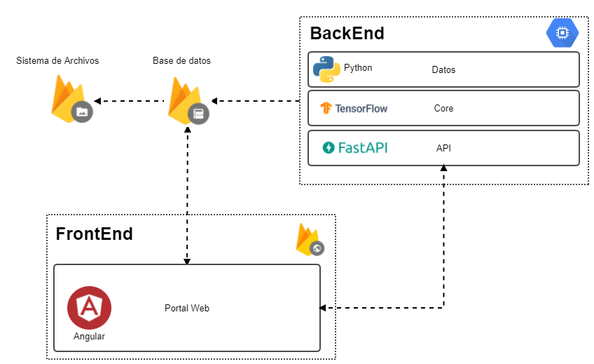
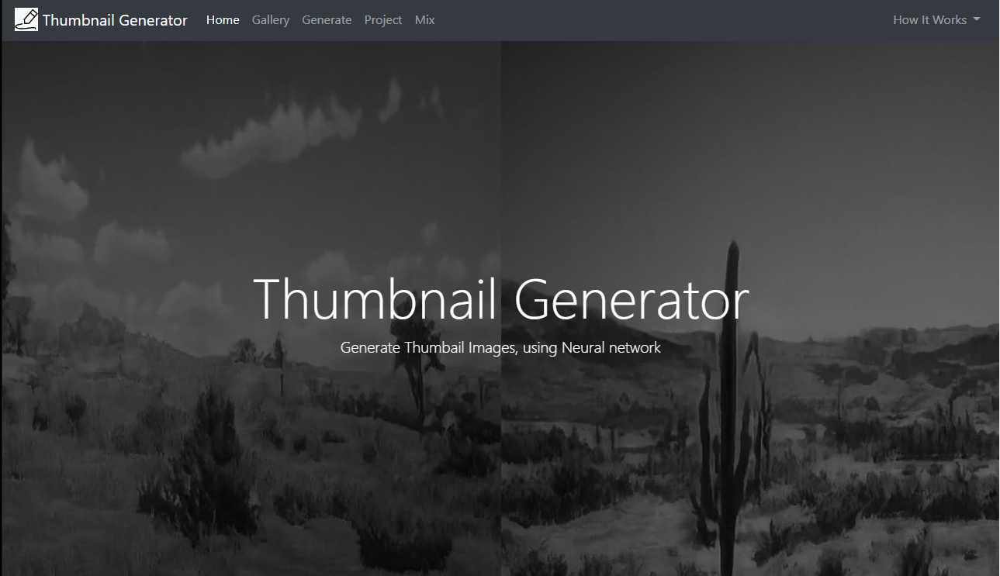
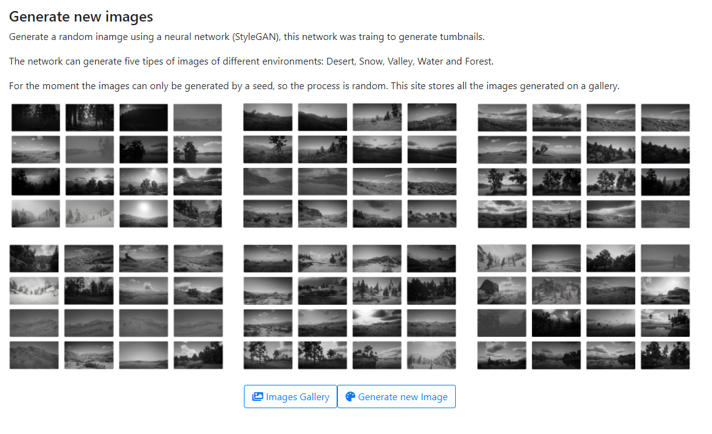
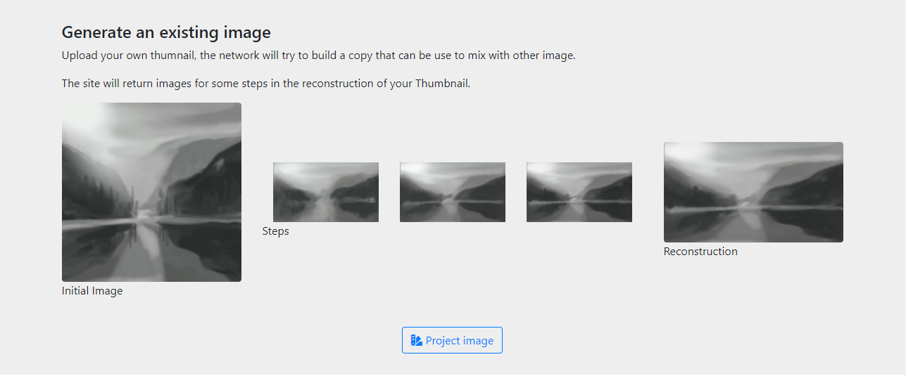
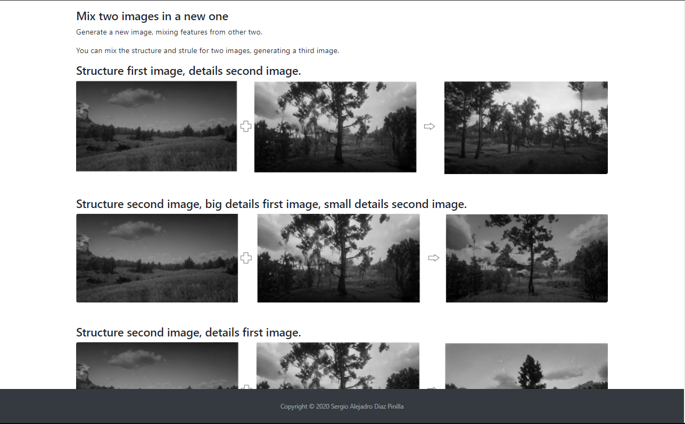
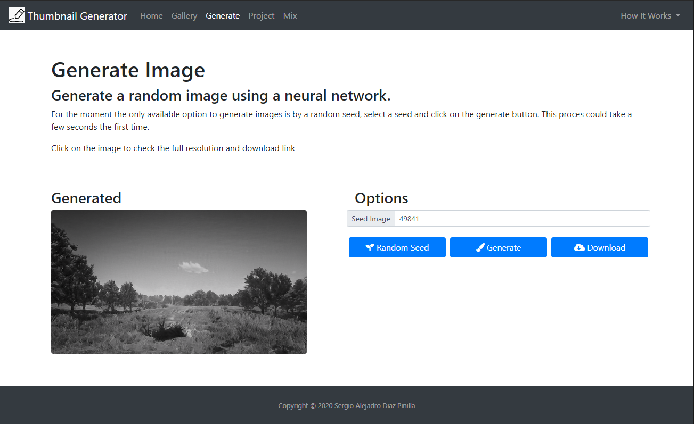
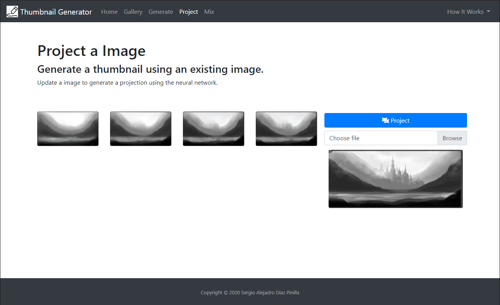
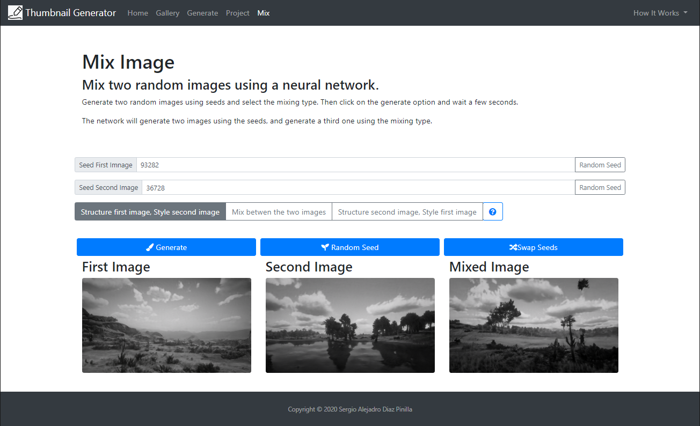

# Thumbnail Art generation web page

This project is a resource constructed For the Magister project Title *"Desarrollo de un prototipo de software de generación de bocetos miniatura con redes neuronales - Universidad Nacional de Colombia - 2020"*
## Architecture
This code is the FrontEnd for the Prototipe

## Home Page

## Generate Image Page

## Project Image Page

## Mix Image Page

